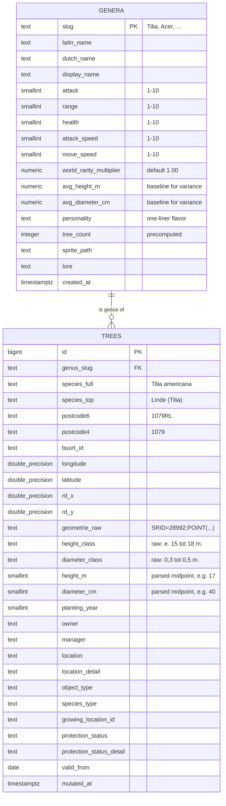

# Boomoorlog — Database Schema (proposal for review)

> This is the **proposed** Postgres schema for M2 (data foundation). Nothing has been
> created in the DB yet — this doc exists so you can review and edit before any SQL
> runs. Once approved, it becomes the spec for `db/001_schema.sql`.
>
> Last updated: 2026-06-28

---

## At a glance

Two tables, one relationship. That's the whole database for M2.



**Reading the relationship:**
`GENERA ||--o{ TREES` means "one genus has zero-or-many trees; every tree belongs to
exactly one genus." Enforced via `trees.genus_slug REFERENCES genera(slug)`.

---

## What goes where, and why

### `genera` — the archetypes (~56 rows)
The game's "characters." Every stat the engine needs to fight a battle is on this row.
Game logic reads from here at runtime; the wiki renders from here.

| Column | Game purpose |
|---|---|
| `slug` | Stable identifier. Used as the FK target, sprite filename, URL slug. |
| `latin_name` / `dutch_name` / `display_name` | Three name variants for UI. |
| `attack`, `range`, `health`, `attack_speed`, `move_speed` | The 5 combat stats locked in STATS.md. Stored as 1–10 ints (cheap, indexable, no float weirdness). |
| `world_rarity_multiplier` | Power multiplier for globally-rare species (Ginkgo, Metasequoia, etc). Default 1.00; >1 only for the rare ones. |
| `avg_height_m` / `avg_diameter_cm` | The genus's average size, used as the baseline for **individual-tree variance** (see section below). Precomputed at seed time. |
| `personality` | One-sentence flavor blurb. Per CHARACTERS.md style. |
| `tree_count` | Precomputed `count(*) from trees` for this genus. Avoids a join+aggregate on every army-builder request. |
| `sprite_path` | Where the pixel sprite lives (e.g. `data/sprites_pixel/Tilia.png`). |
| `lore` | Long research blurb from `memory/characters/<slug>.md`. |

### `trees` — the real-world census (~298,734 rows)
The Amsterdam tree dataset, one row per real tree. The army builder queries this by
postcode and aggregates by genus.

**Game-relevant columns** (these are what M5 actually reads):
`genus_slug`, `postcode4`, `postcode6`, `longitude`, `latitude`, `height_m`,
`diameter_cm`, `planting_year`.

`height_m` and `diameter_cm` are the **parsed midpoints** of `height_class` /
`diameter_class`. We keep both: the raw class strings (audit / UI) and the
numeric midpoints (math).

**Everything else** (`owner`, `manager`, `protection_status`, `geometrie_raw`, etc.)
is preserved as raw data per your call ("import everything") so we can answer
future questions like "are protected trees stronger?" without re-ingesting the CSV.

---

## Sample rows (what real data looks like)

### `genera` — sample row
```
slug                    : Tilia
latin_name              : Tilia
dutch_name              : Linde
display_name            : Linde (Tilia)
attack                  : 6
range                   : 8
health                  : 7
attack_speed            : 5
move_speed              : 4
world_rarity_multiplier : 1.00
personality             : "Patient giant of European streets — long-lived, heart-shaped, beloved by bees."
tree_count              : 32487   (filled in step 7)
sprite_path             : data/sprites_pixel/Tilia.png
lore                    : (long text from memory/characters/Tilia.md)
created_at              : 2026-06-28 12:00:00+00
```
*(Stat values above are illustrative — actual numbers come from the existing
generate_characters.py output.)*

### `trees` — sample row (real data, row 1 of the CSV)
```
id                       : 919933
genus_slug               : Tilia
species_full             : Tilia americana
species_top              : Linde (Tilia)
postcode6                : 1079RL
postcode4                : 1079
buurt_id                 : 03630980000301
longitude                : 4.9046709
latitude                 : 52.3398135
rd_x                     : 122115.11
rd_y                     : 483653.0
geometrie_raw            : SRID=28992;POINT (122115.11 483653)
height_class             : e. 15 tot 18 m.
diameter_class           : NULL
planting_year            : 1948
owner                    : Gemeente Amsterdam
manager                  : R&E_VOR_Bomen
location                 : Groenobject
location_detail          : NULL
object_type              : Boom niet vrij uitgroeiend
species_type             : Bomen
growing_location_id      : NULL
protection_status        : NULL
protection_status_detail : NULL
valid_from               : 2020-03-10
mutated_at               : 2025-12-10 11:44:32.879822+00
```

---

## The queries this schema is built to serve

These are the actual queries M4–M8 will run. The schema is designed so each one is
either a `WHERE` lookup or a simple aggregate — no joins required for the hot paths.

### Q1 — Army composition for a ZIP (the core game query)
> "What trees are in postcode 1079, grouped by genus?"
```sql
SELECT genus_slug, COUNT(*) AS n
FROM trees
WHERE postcode4 = '1079'
GROUP BY genus_slug
ORDER BY n DESC;
```
**Cost**: index scan on `postcode4` (step 4 adds this index). Fast.

### Q2 — Pull stats for a genus (wiki + engine)
> "Give me the stat block for Tilia."
```sql
SELECT * FROM genera WHERE slug = 'Tilia';
```
**Cost**: primary key lookup. Instant.

### Q3 — Army builder, full version (joins Q1 + Q2)
> "Build an army for postcode 1079 — genera with counts AND stats, in one query."
```sql
SELECT g.*, t.n
FROM (
  SELECT genus_slug, COUNT(*) AS n
  FROM trees
  WHERE postcode4 = '1079'
  GROUP BY genus_slug
) t
JOIN genera g ON g.slug = t.genus_slug
ORDER BY t.n DESC;
```
**Cost**: index scan + 56-row hash join. Still fast.

### Q4 — Trees for a map view (M4)
> "Give me all trees in postcode 1079HL with coords for pins."
```sql
SELECT id, genus_slug, longitude, latitude, height_class
FROM trees
WHERE postcode6 = '1079HL';
```
**Cost**: index scan on `postcode6`. Fast.

---

## Individual-tree variance

**The 1–10 genus stats are the baseline. Individual trees deviate from that baseline
based on their actual measurements.** A 20m Tilia in a genus that averages 15m is
stronger than a 10m Tilia of the same genus.

**How it works:**
- `trees.height_m` and `trees.diameter_cm` = this specific tree's measurements
  (parsed once at seed time from the class strings).
- `genera.avg_height_m` and `genera.avg_diameter_cm` = the baseline for that genus.
- The army builder (M5) computes a per-tree **power modifier** at runtime, e.g.
  `modifier = tree.height_m / genus.avg_height_m`, and applies it to attack / range
  / health.

**The formula lives in code, not the DB.** Specifically `pipeline/stats.py`
(introduced in M2 step 5), so we can iterate on the curve — linear, capped, square
root, weighted between height and diameter — without re-seeding the database.

**Why not store the modifier per tree?** Premature: locks the formula in. Computing
on the fly with the two raw inputs is cheap and keeps tuning easy.

---

## What we are NOT doing (and why)

| Skipped thing | Why |
|---|---|
| PostGIS extension | Trees already carry `postcode6`/`postcode4`. Spatial queries aren't needed yet. Add when M4 wants "radius around a point" or "draw the boundary polygon." |
| `postcodes` table with boundary geometries | Same reason — no boundary work needed yet. The 315 MB PC6 GeoJSON stays offline. |
| Separate `species` table | One genus = one stat block (locked in VISION.md). Species variation (`Tilia americana` vs `Tilia cordata`) is preserved on `trees.species_full` for filtering/curiosity, but doesn't drive stats. |
| Per-tree custom stats | Stats live on `genera`, not `trees`. Trees contribute *count* and *aggregate properties* (avg height in a ZIP, etc.) — not individual stat blocks. |
| `users` / `battles` tables | Not until M9. M2 is just the source-of-truth seed. |
| Indexes on game-stat columns (`attack`, `health`, etc.) | Genera is 56 rows. A full table scan is faster than an index lookup. Indexes only matter on `trees`. |

---

## Open questions before I write the SQL

1. **`world_rarity_multiplier` type**: I have it as `numeric(3,2)` (range 0.00–9.99). Locked range is 1.0–~3.0. OK?
2. **`personality` length**: capping with `text` (unlimited). Want a constraint like "max 280 chars"? Default no — `text` is simpler.
3. **`tree_count` placement**: I have it on `genera` as a precomputed integer. Alternative: a `genera_with_counts` SQL view that joins+aggregates on every read. The precomputed column is faster and simpler; the trade-off is we have to re-run the backfill step if `trees` ever changes (which it shouldn't, since the CSV is a one-time import). Stick with precomputed?
4. **`geometrie_raw` storage**: keeping the original `SRID=28992;POINT (...)` string as plain text since we're not using PostGIS yet. When we add PostGIS later, we'll either parse this or recompute from `rd_x`/`rd_y`. OK?
5. **Anything missing or extra?** Now's the time to add/remove columns before SQL is written.
